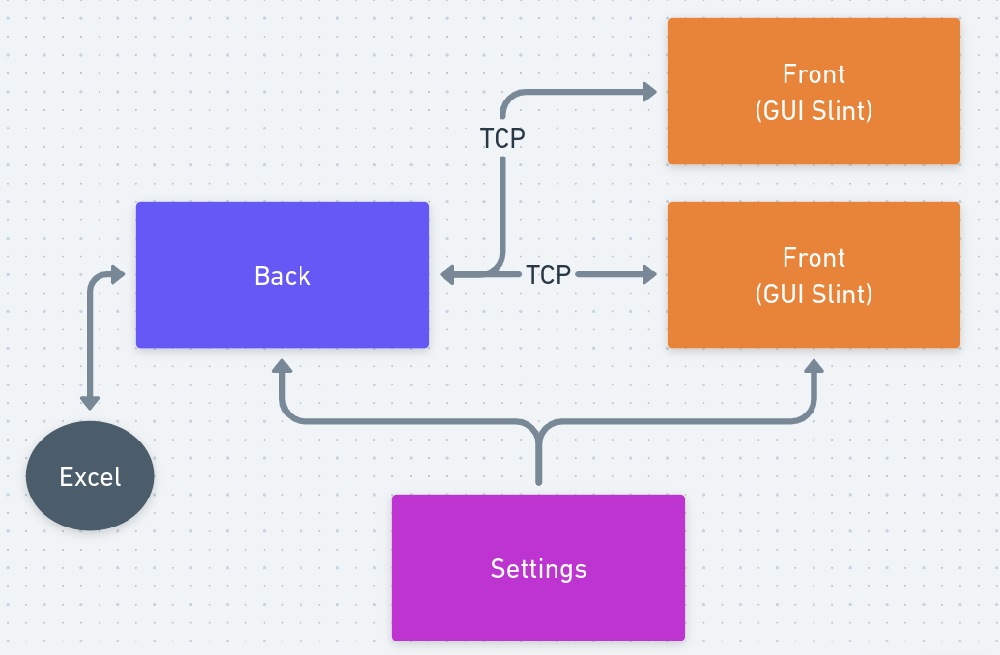

# Prisoner Dilemma game - RUST - TCP - GUI (SLINT)

## Overview

The project demonstrates the classic game theory scenario of the Prisoner's Dilemma, allowing multiple players to interact and make decisions that affect their game strategies.

### Game Rules

* Each player has two choices: cooperate or defect.
* If both players cooperate, they both receive a moderate reward.
* If both players defect, they both receive a small reward.
* If one player cooperates and the other defects, the defector receives a higher reward, and the cooperator receives nothing.

### Features

* **TCP Communication** : Implements a server-client architecture for multiplayer gameplay using TCP sockets.
* **Slint GUI** : Integrates the Slint framework to create an intuitive graphical user interface for players to make decisions and observe game outcomes.
* **Prisoner's Dilemma Logic** : Implements the game logic, including the decision-making process based on strategies chosen by players and put the result inside a xlxs file.

### Usage

1. **Clone the Repository**
2. **Build and Run**
3. **Using the Application**
4. **Run Test**

### How to run

> make runb // create back server
> make runf // create client to play the game

## Schema

### Code Structure

- **back**: Houses the game logic, employing multithreading to manage multiple TCP connections concurrently.
- **settings**: Encompasses the game logic and communication protocols.
- **front**: Interfaces with Slint and manages TCP streams for the graphical user interface and communication processes.

### Future Improvements

- **Enhanced Protocol Processing:** Refine the protocol processing mechanism to minimize the need for adjustments whenever there are modifications to the protocol structure. This could involve streamlining the protocol handling logic for increased adaptability to structural changes.

- **Rematch System Implementation:** Introduce a rematch system that allows players to initiate new game sessions without exiting the application. This addition can enhance user experience by providing a seamless and efficient way to continue playing consecutive rounds without interruption.

